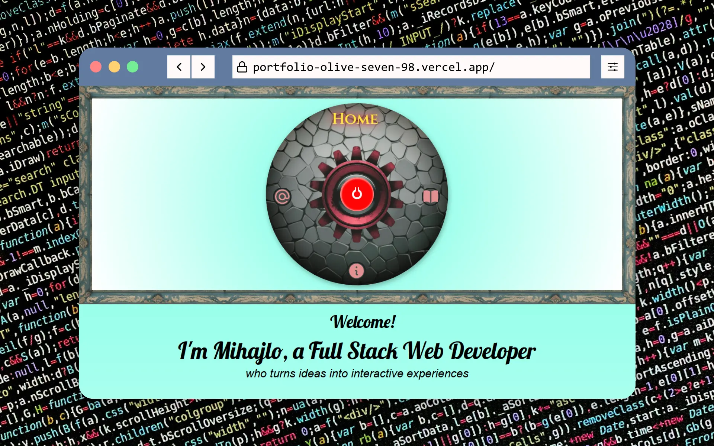
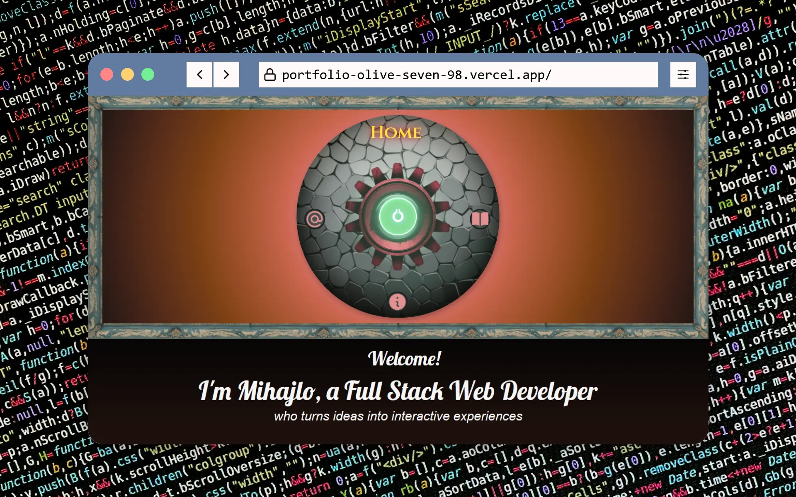
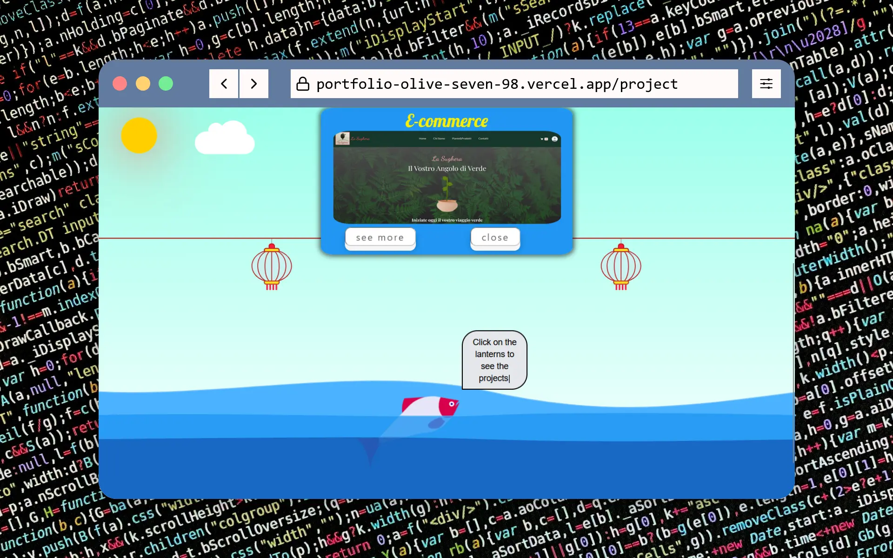
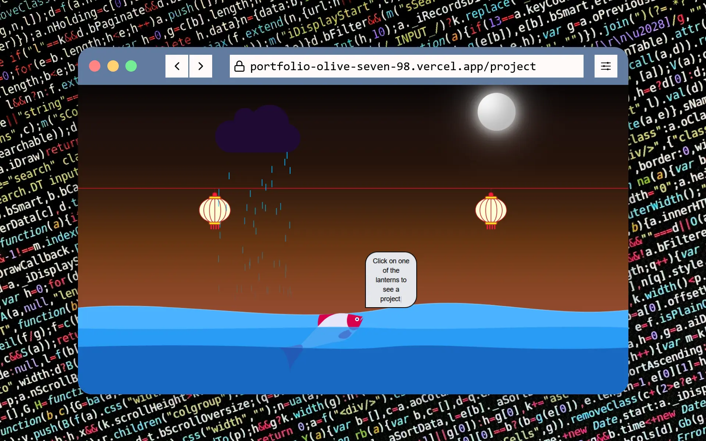
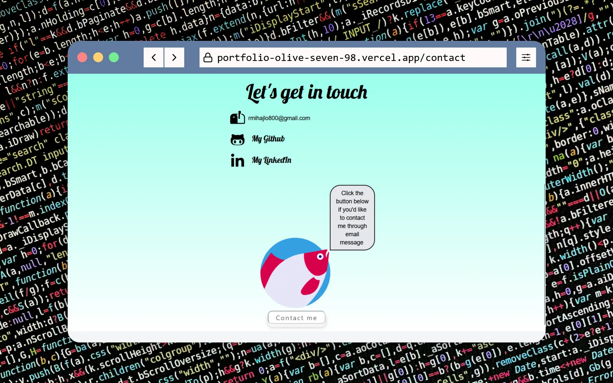
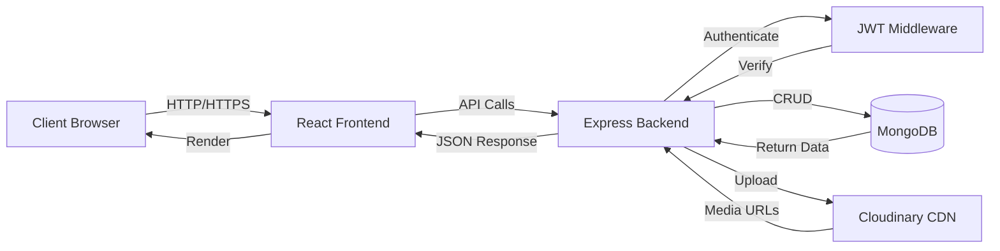

<div align="center">


# 🌟 Personal Portfolio
[](https://reactjs.org/) [](https://nodejs.org/) [](https://www.mongodb.com/) [](https://tailwindcss.com/)

[](https://opensource.org/licenses/MIT) []() []()

**A modern, responsive portfolio website with complete admin panel for content management**

[](https://portfolio-olive-seven-98.vercel.app/) [](#getting-started) [](https://github.com/mihail093/Portfolio/issues) [](https://github.com/mihail093/Portfolio/issues)

</div>

---

## 📸 Screenshots

<div align="center">
  
  
  <br>
  <em>HOME PAGE Light and Dark Theme</em>
</div>

<br>

<div align="center">
  
  
  <br>
  <em>PROJECTS PAGE Light and Dark Theme</em>
</div>

<br>

<div align="center">
  
  <br>
  <em>CONTACT PAGE</em>
</div>

---

## ✨ Features

<table>
  <tr>
    <td>
      <h3>🎨 Frontend</h3>
      <ul>
        <li>📱 Fully Responsive Design</li>
        <li>🌓 Dark/Light Theme</li>
        <li>✨ Various Animations</li>
        <li>📸 Image carousel for each project</li>
        <li>🎬 Intro video for each project</li>
      </ul>
    </td>
    <td>
      <h3>🔐 Backend</h3>
      <ul>
        <li>🛡️ JWT Authentication</li>
        <li>📊 Full CRUD Operations</li>
        <li>☁️ Cloudinary Integration</li>
        <li>⭐ Featured Projects</li>
        <li>🎯 Real-time Updates</li>
      </ul>
    </td>
  </tr>
</table>

---

## 🛠️ Tech Stack

<div align="center">

### Frontend Technologies
<p>
  
  
  
  
</p>

### Backend Technologies
<p>
  
  
  
  
  
</p>

</div>

---

## 📊 Architecture



---

## 🚀 Getting Started

<details>
<summary><b>📋 Prerequisites</b></summary>

Before you begin, ensure you have the following installed:

- **Node.js**
- **npm** or **yarn**
- **MongoDB** (local installation or MongoDB Atlas account)
- **Cloudinary Account**
- **EmailJS Account**
- **Git** (for cloning the repository)

</details>

<details>
<summary><b>⚡ Quick Start</b></summary>

### 1️⃣ Clone the repository

```bash
git clone https://github.com/mihail093/Portfolio.git
cd portfolio
```

### 2️⃣ Install dependencies

```bash
# Backend
cd backend
npm install

# Frontend
cd ../frontend
npm install
```

### 3️⃣ Configure environment variables

Create `.env` files in both backend and frontend directories:

**Backend `.env`:**
```env
PORT=5000
MONGODB_URI=your_mongodb_connection_string
JWT_SECRET=your_super_secret_jwt_key
JWT_EXPIRES_IN=1d
ADMIN_EMAIL=admin@example.com
ADMIN_PASSWORD=your_secure_password
ADMIN_NAME=your_name
CLOUDINARY_CLOUD_NAME=your_cloud_name
CLOUDINARY_API_KEY=your_api_key
CLOUDINARY_API_SECRET=your_api_secret
NODE_ENV=production
CLIENT_URL=http://localhost:5173
```

**Frontend `.env`:**
```env
VITE_API_URL=http://localhost:5000/api
VITE_EMAILJS_SERVICE_ID=your_service_id
VITE_EMAILJS_TEMPLATE_ID=your_template_id
VITE_EMAILJS_PUBLIC_KEY=your_public_key
```

### 4️⃣ Start the application

```bash
# Start backend (from backend directory)
npm start

# Start frontend (from frontend directory)
npm run dev
```

🎉 **Application is now running!**
- Frontend: http://localhost:5173
- Backend: http://localhost:5000

</details>

---

## 📁 Project Structure

<details>
<summary><b>Click to view project structure</b></summary>

```
portfolio/
├── 📂 backend/
│   ├── 📂 config/
│   │   ├── cloudinary.js
│   │   ├── db.js
│   │   └── jwt.js
│   ├── 📂 controllers/
│   │   ├── authController.js
│   │   ├── mediaController.js
│   │   └── projectController.js
│   ├── 📂 middleware/
│   │   └── authMiddleware.js
│   ├── 📂 models/
│   │   ├── Admin.js
│   │   ├── Media.js
│   │   └── Project.js
│   ├── 📂 routes/
│   │   ├── authRoutes.js
│   │   ├── mediaRoutes.js
│   │   └── projectRoutes.js
│   ├── .env
│   ├── server.js
│   └── package.json
│
└── 📂 frontend/
    ├── 📂 src/
    │   ├── 📂 components/
    │   │   ├── 📂 admin/
    │   │   ├── 📂 layout/
    │   │   ├── 📂 ui/
    │   │   └── 📂 animations/
    │   ├── 📂 context/
    │   │   ├── AuthContext.jsx
    │   │   └── ThemeContext.jsx
    │   ├── 📂 pages/
    │   │   ├── Home.jsx
    │   │   ├── Projects.jsx
    │   │   ├── About.jsx
    │   │   └── Contact.jsx
    │   ├── 📂 services/
    │   │   ├── apiService.js
    │   │   └── authService.js
    │   ├── App.jsx
    │   └── main.jsx
    ├── .env
    ├── package.json
    └── vite.config.js
```

</details>

---

## 🔐 API Endpoints

<details>
<summary><h4>Authentication</h4></summary>

| Method | Endpoint | Description | Auth Required |
|--------|----------|-------------|---------------|
| POST | `/api/auth/admin/login` | Admin login | ❌ |
| GET | `/api/auth/admin/me` | Get admin profile | ✅ |
| GET | `/api/auth/admin/logout` | Logout admin | ✅ |

</details>

<details>
<summary><h4>Projects</h4></summary>

| Method | Endpoint | Description | Auth Required |
|--------|----------|-------------|---------------|
| GET | `/api/projects` | Get all projects | ❌ |
| GET | `/api/projects/:id` | Get single project | ❌ |
| GET | `/api/projects/featured` | Get featured projects | ❌ |
| POST | `/api/projects` | Create new project | ✅ |
| PUT | `/api/projects/:id` | Update project | ✅ |
| DELETE | `/api/projects/:id` | Delete project | ✅ |

</details>

<details>
<summary><h4>Media</h4></summary>

| Method | Endpoint | Description | Auth Required |
|--------|----------|-------------|---------------|
| GET | `/api/media` | Get all media | ❌ |
| GET | `/api/media/:id` | Get single media | ❌ |
| GET | `/api/media/tags` | Get all tags | ❌ |
| POST | `/api/media` | Upload media | ✅ |
| DELETE | `/api/media/:id` | Delete media | ✅ |

</details>

## 📝 License

Distributed under the MIT License. See `LICENSE` for more information.

---

### 👨‍💻 Author

<div align="center">

### **Mihajlo Radosavljevic**

[](https://portfolio-olive-seven-98.vercel.app/)
[](https://www.linkedin.com/in/mihajlo-radosavljevic-57a19332b/)
[](https://github.com/mihail093)
[](mailto:rmihajlo800@gmail.com)

</div>

---

## 💖 Support

<div align="center">

If you found this project helpful, please consider giving it a ⭐!

[](https://star-history.com/#mihail093/Portfolio&Date)

</div>

---

<div align="center">

### Show Some ❤️ by Starring this Repository!

Made with 💙 and ☕ by [Mihajlo Radosavljevic](https://github.com/mihail093)


</div>
